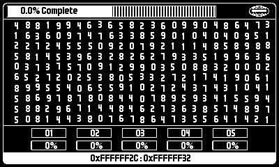
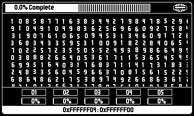

# playdate-mdr

Macrodata Refinement terminal for play.date

_The work is mysterious and important._

@see https://severance.wiki/macrodata_refinement

**Inspired from the TV show Severance (available on [Apple TV+](https://tv.apple.com/us/show/severance/umc.cmc.1srk2goyh2q2zdxcx605w8vtx)).**

_This is made by a fan for the fans, with no commercial purpose._

## What is it?

**Please, consider this as a concept (not game) session may be long to acheive 100% completion, it resets once 100% reached.**

1. Move using D-Pad

2. Once you have found scary numbers crank! 

3. Look for next numbers.

_n.b - no more feature planned, and code will stay all over the place (no factoring, too few comments...)._

_n.b 2 - further testing on device may be required_

## Getting started

### Pre-requisite

- Download Playdate sdk here : https://play.date/dev/ 

- Install it, on `macOS` Playdate sdk installation is located here: `~/Developer/PlaydateSDK`

### Start

1. Build/Compile game :

       pdc source dist/mdr-terminal.pdx

    or

        run and build in vscode

2. Run it on emulator :

    1. (macOS) launch `~/Developer/PlaydateSDK/bin/Playdate Simulator.app`

    2. In the simulator use file menu to load `dist/mdr-terminal.pdx`
    
3. While developping :

    1. Re build

    2. Restart simulator (cmd-r on macOS)

4. Sideload on real-device

    https://help.play.date/games/sideloading/

## Building for release

    pdc -s source dist/mdr-terminal.pdx

## Usefull links

https://www.gingerbeardman.com/canvas-dither/